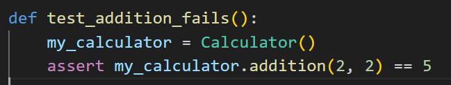
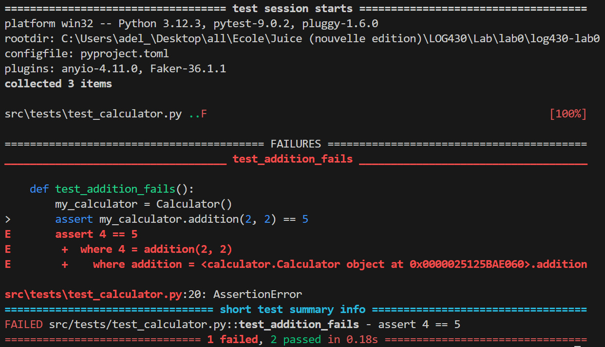
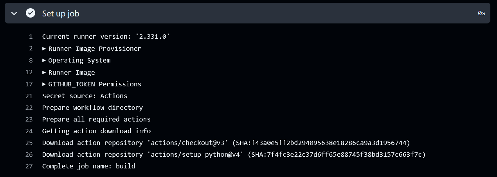
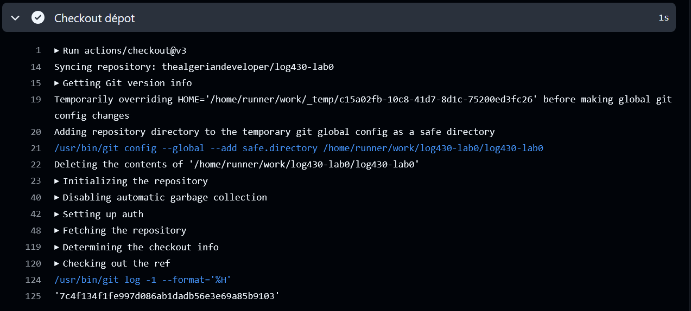
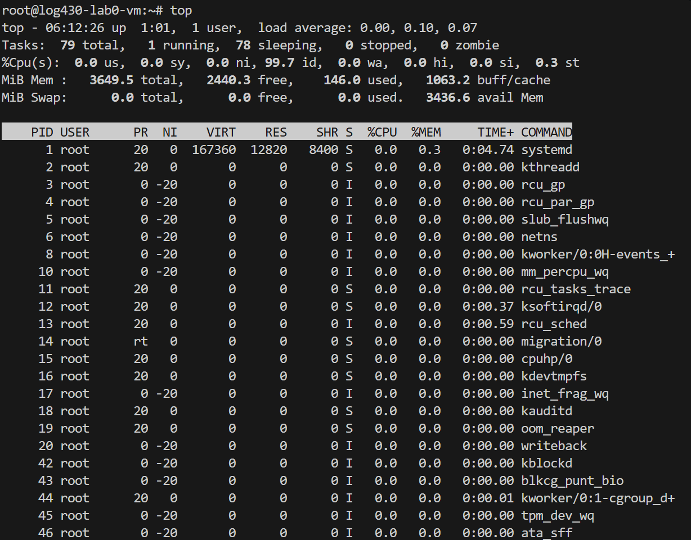
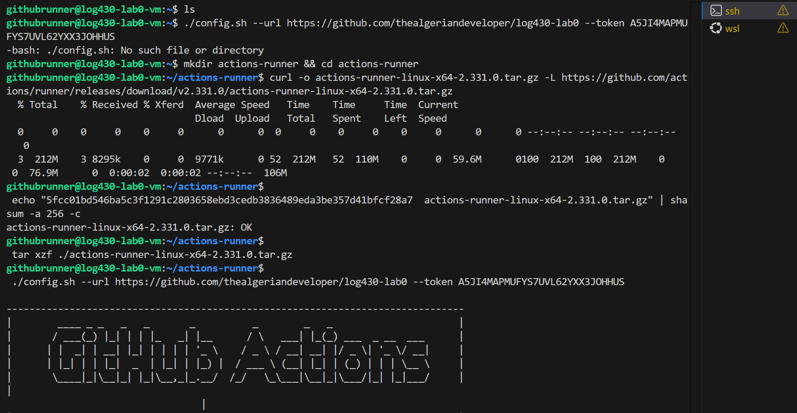
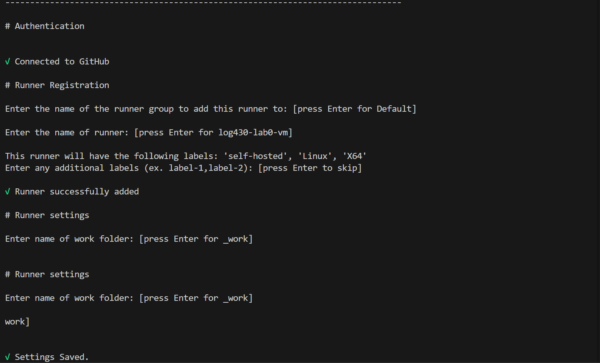
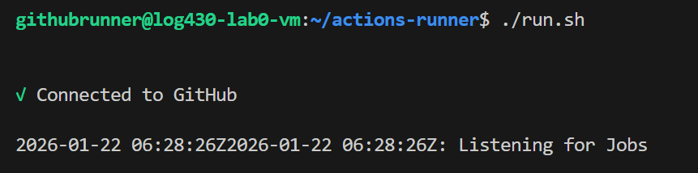
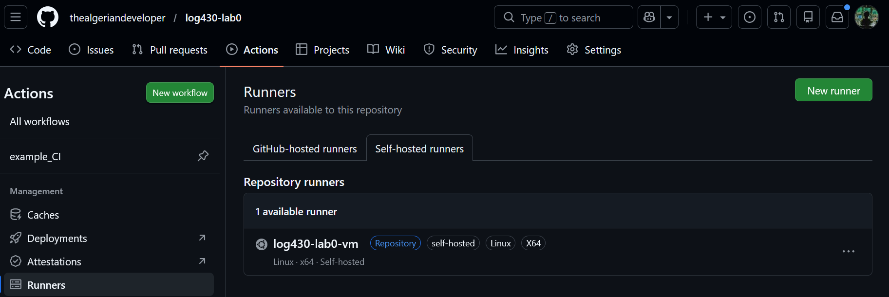

# Exemple de soumission d'activité
ÉTS - LOG430 - Architecture logicielle - Hiver 2026

Étudiant(e) : Adel Belhadj

# Questions
(Il est obligatoire d'ajouter du code, des captures d'écran ou des sorties de terminal pour illustrer chacune de vos réponses.)

## 1. Si l'un des tests échoue à cause d'un bug, comment pytest signale-t-il l'erreur et aide-t-il à la localiser ? Rédigez un test qui provoque volontairement une erreur, puis montrez la sortie du terminal obtenue.
Quand un test échoue, pytest le signale immédiatement en affichant un statut FAILED et en indiqunt précisément où se trouve le problème. Concrètement, il affiche le nom du fichier et la ligne du test qui a échoué, puis le bloc FAILURES qui contient l'expression assert fautive, et les valeurs évaluées. Si l'échec provient plûtot d'une exception, pytest affiche l'exception avec une traceback qui remonte la pile de calls jusqu'à la ligne exacte qui en est responsable. Grâce à ces éléments, on peut localiser rapidement un bug, on sait quel test échoue et à quel endroit, et quelle valeur réelle a été obtenue par rapport à celle attendue.

Pour illustrer cela, j'ai créé un test qui est volontairement faux dans test_calculator.py, puis j'ai exécuté pytest. Voici le code du test:

Voici une capture d'écran du output du terminal une fois qu'on a lancé la commande pytest:

## 2. Que fait GitHub pendant les étapes de « setup » et « checkout » ? Veuillez inclure la sortie du terminal GitHub CI dans votre réponse.
Pendant les étapes setup et checkout d'un workflow GitHub Actions, GitHub prépare d'abord le job via une étape Set up job. Cette étape sert à initialiser l'environnement d'exécution sur le runner afin que les étapes suivantes s'exécutent dans un environnement qui est cohérent. Ensuite, l'étape checkout récupère le dépôt dans l'espace de travail du runner pour que le workflow puisse accéder au code source et exécuter des commandes comme l'installation des dépendances et l'exécution des tests. Par défaut, actions/checkout récupère uniquement le commit associé au event qui a déclenché le cworkflow, sauf si on change la configuration.

## 3. Quel type d'informations pouvez-vous obtenir via la commande top ? Veuillez donner quelques exemples. Veuillez inclure la sortie du terminal dans votre réponse.
La commande top sert à surveiller en temps réel l'état de la VM et la consommation de ses ressources. Elle donne d'abord un résumé global du système puis uns liste des processus triés. On peut y retrouver le load average, le uptime, le nombre total de processus et leur état, l'utilisation du CPU en pourcentage, l'utilisation de la mémoire vive, l'utilisation de la mémoire swap et des informations reliées à chaque processus comme le PID.

# Déploiement
Dans ce laboratoire, le déploiement continu a été automatisé à l'aide d'un GitHub Runner self-hosted installé directement sur la VM. L'idée est que le job GitHub Actions ne s'exécute pas sur un runner cloud, mais sur la VM elle-même, ce qui permet de déployer sans ouvrir de ports supplémentaires et sans dépendre d'un mécanisme de webhook externe. Après l'installation des dépendances du runner, un utilisateur a été créé pour respecter la contrainte du runner (ne pas être exécuté en sudo), puis le runner a été enregistré sur le dépôt GitHub avec le script config.sh en fournissant l'URL du repo et un token d'inscription. 

Une fois configuré, le runner a été démarré et confirmé être Online dans l'interface GitHub:

